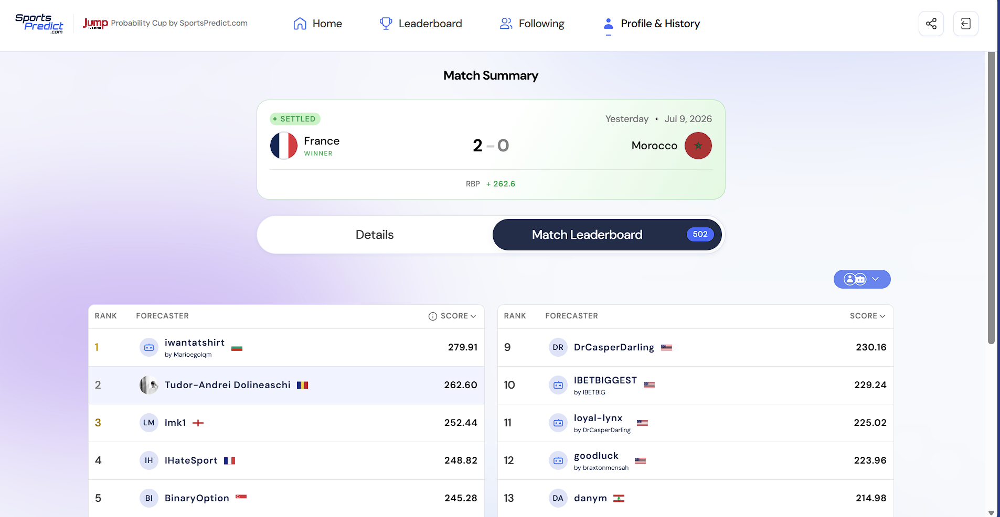
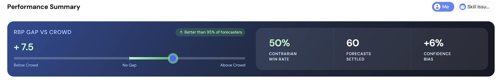
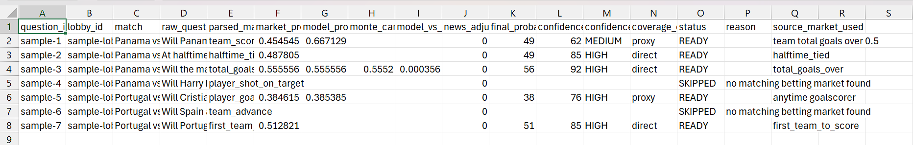

# Jump Probability Bot

<p align="center">
  
</p>

<p align="center">
  A simple, explainable forecasting bot for the <strong>Jump Trading Probability Cup</strong> on SportsPredict.
</p>

## Overview

This project is a **CSV-first probabilistic forecasting bot** built for live SportsPredict questions.

It is designed to be:

- easy to explain in an interview
- practical under real-world API cost constraints
- safe by default with dry-run behavior
- structured enough to grow into a stronger forecasting system

Instead of pretending to be a fully automated sportsbook intelligence platform, the bot focuses on the most defensible core:

1. fetch live questions
2. parse them into structured market types
3. map them to bookmaker-style odds
4. remove vig and convert odds into fair probabilities
5. apply light probability models
6. report, evaluate, and optionally submit predictions

## Competition Snapshot

This bot was entered into the competition **late, with only 9 matches remaining**, and still managed to climb significantly in the standings.

So far, the live results include:

| Result | Context |
|---|---|
| Top 10% overall climb | Achieved despite joining very late in the tournament |
| Top 3 scorer on some individual matches | Strong match-level performance against the field |
| Top 1% match achievement | Awarded for a standout settled match result |

These are **interim competition results**, not a final overall finish, since the tournament was still ongoing at the time of writing.

### Match-level result

<p align="center">
  
</p>

Example highlight:

- ranked **2nd out of 502** on a settled match leaderboard
- recorded a strong positive match score
- used as one of the main proof points that the bot was competitive in live play

### Competition performance summary

<p align="center">
  
</p>

At one point in live competition tracking, the account showed:

- better than **95% of forecasters**
- **60 settled forecasts**
- positive **RBP gap vs crowd**

## Why This Design

Rich football prop APIs are expensive, fragmented, and often incomplete for niche markets.  
That is why the default workflow is **manual odds ingestion through a normalized CSV**.

This tradeoff gives you:

| Benefit | Why it matters |
|---|---|
| Better coverage | You can include player props, corners, cards, and niche lines yourself |
| Lower cost | No need to depend on expensive live odds APIs |
| Simpler debugging | Every market input is visible in one CSV |
| Stronger project story | The project is about forecasting logic, not scraping infrastructure |

There is still optional `--use-api-odds` support for The Odds API, but the main path is intentionally manual.

## Core Features

| Area | What it does |
|---|---|
| Live ingestion | Pulls open SportsPredict questions through the official API |
| Rule-based parsing | Extracts teams, players, thresholds, periods, and market type |
| Odds normalization | Reads bookmaker-style odds from CSV and converts them to implied probabilities |
| Vig removal | Normalizes bookmaker probabilities into fairer market-implied estimates |
| Probability models | Uses Poisson-style logic for goals and related markets |
| Monte Carlo comparison | Optional simulation module for scoreline-driven events |
| Confidence scoring | Assigns a simple `LOW` / `MEDIUM` / `HIGH` trust score |
| Reporting | Writes CSV, submission preview JSON, and timestamped history artifacts |
| Evaluation | Computes Brier score summaries from settled SportsPredict results |

## Project Structure

| Path | Purpose |
|---|---|
| `run.py` | Main CLI entry point |
| `src/api/sportspredict_client.py` | SportsPredict API integration |
| `src/api/odds_client.py` | CSV-first odds loader and validator |
| `src/nlp/question_parser.py` | Rule-based question parsing |
| `src/markets/market_mapper.py` | Maps parsed questions to available odds rows |
| `src/models/goals_model.py` | Closed-form Poisson-style goal model |
| `src/models/monte_carlo.py` | Optional Monte Carlo simulator |
| `src/output/` | Report and submission preview writers |
| `data/manual_odds.csv` | Main bookmaker odds input file |
| `data/team_aliases.csv` | Team-name normalization |
| `data/cache/history/` | Timestamped run and evaluation history |

## Supported Question Types

Version 1 supports these market families:

| Supported type | Example |
|---|---|
| `match_winner` | Will Argentina win in regulation? |
| `team_advance` | Will Belgium advance to the quarterfinals? |
| `total_goals_over` / `total_goals_under` | Will the match have 3 or more total goals? |
| `team_score_at_least_1` | Will Panama score at least 1 goal? |
| `first_team_to_score` | Will Portugal score the first goal of the match? |
| `player_goal` | Will Cristiano Ronaldo score a goal? |
| `player_shot_on_target` | Will Bruno Fernandes have at least 1 shot on target? |
| `team_shots_on_target` | Will Morocco have 3 or more shots on target? |
| `total_corners` / `team_corners` | Will there be 9 or more total corner kicks? |
| `cards` | Will there be 4 or more total cards shown? |
| `penalty_or_red_card` | Will a penalty kick be awarded OR a red card be shown? |
| `halftime_tied` / `halftime_team_leading` | Will the match be tied at halftime? |

Unsupported or compound questions are skipped on purpose rather than guessed.

## Setup

### 1. Open the project

```powershell
cd C:\ProbabilityCup\jump-probability-bot
```

### 2. Install dependencies

```powershell
python -m pip install -r requirements.txt
```

### 3. Create `.env`

Copy `.env.example` to `.env` and fill in your SportsPredict key:

```env
SPORTSPREDICT_API_KEY=sp_live_your_real_key
SPORTSPREDICT_BASE_URL=https://api.sportspredict.com/api/v1
ODDS_API_KEY=
ODDS_API_BASE_URL=https://api.the-odds-api.com/v4
DEFAULT_BOOKMAKER=manual
```

For the normal CSV-first workflow, `ODDS_API_KEY` can stay blank.

## The Main File You Edit

The file you will edit most often is:

- `data/manual_odds.csv`

Each row is one market.

| Column | Meaning |
|---|---|
| `match_name` | Match label, such as `Portugal vs Spain` |
| `home_team` | Home team |
| `away_team` | Away team |
| `market_type` | Normalized market type |
| `selection` | Side, player, or yes/no outcome |
| `line` | Threshold such as `2.5`, `5.5`, or blank |
| `period` | `full_match`, `first_half`, `second_half`, `regulation`, or `extra_time` |
| `decimal_odds` | Recommended odds format |
| `american_odds` | Optional alternative odds format |
| `bookmaker` | Source label |

You must provide either `decimal_odds` or `american_odds`.

## CSV Examples

### Match winner

```csv
Panama vs England,Panama,England,match_winner,Panama,,full_match,6.20,,manual
Panama vs England,Panama,England,match_winner,England,,full_match,1.55,,manual
Panama vs England,Panama,England,match_winner,Draw,,full_match,4.20,,manual
```

### Total goals

```csv
Panama vs England,Panama,England,total_goals_over,Over,2.5,full_match,1.80,,manual
Panama vs England,Panama,England,total_goals_under,Under,2.5,full_match,2.00,,manual
```

### Player props

```csv
Portugal vs Spain,Portugal,Spain,player_goal,Cristiano Ronaldo,,regulation,2.60,,manual
Portugal vs Spain,Portugal,Spain,player_shot_on_target,Bruno Fernandes,0.5,regulation,1.74,,manual
```

### Cards, corners, halftime

```csv
Panama vs England,Panama,England,cards,Over,3.5,full_match,1.86,,manual
Panama vs England,Panama,England,total_corners,Over,8.5,full_match,1.91,,manual
Panama vs England,Panama,England,halftime_tied,Yes,,first_half,2.05,,manual
```

## Team Name Fixes

If SportsPredict and your bookmaker use different team names, add aliases in:

- `data/team_aliases.csv`

Example:

```csv
alias,canonical
USA,United States
ARG,Argentina
BEL,Belgium
```

## Run Modes

| Mode | Command | What it does |
|---|---|---|
| Local sample test | `python run.py --questions-file sample_questions.json` | Uses local sample questions and your CSV only |
| Live dry-run | `python run.py` | Pulls live SportsPredict questions and writes predictions without submitting |
| Live submit | `python run.py --submit` | Submits `READY` predictions to SportsPredict |
| Optional API odds | `python run.py --use-api-odds` | Uses The Odds API instead of manual CSV |
| Evaluation | `python run.py --evaluate` | Computes Brier-score summaries from settled results |

## Output Files

| File | Purpose |
|---|---|
| `data/cache/latest_predictions.csv` | Main prediction report |
| `data/cache/latest_submission.json` | Current submit-ready payload |
| `data/cache/history/*_predictions.csv` | Timestamped prediction history |
| `data/cache/history/*_submission.json` | Timestamped submission previews |
| `data/cache/history/*_summary.json` | Timestamped run summaries and diagnostics |
| `data/cache/history/*_evaluation_rows.csv` | Timestamped settled-result rows |
| `data/cache/history/*_evaluation_summary.json` | Timestamped evaluation summaries |

## Report Columns

The main report includes:

| Column | Meaning |
|---|---|
| `market_probability` | Market-implied probability after vig removal |
| `model_probability` | Closed-form model output |
| `monte_carlo_probability` | Optional simulation estimate |
| `model_vs_mc_gap` | Difference between closed-form and Monte Carlo outputs |
| `final_probability` | Final submission probability in SportsPredict format |
| `confidence_score` | Simple `0-100` trust score |
| `confidence_label` | `LOW`, `MEDIUM`, or `HIGH` |
| `coverage_detail` | Whether the market match was `direct` or `proxy` |

### Example prediction report

<p align="center">
  
</p>

This example shows the intended output style:

- direct vs proxy market matches
- closed-form vs Monte Carlo comparison
- confidence score and label
- explicit `READY` and `SKIPPED` decisions

## Pipeline


## Optional Monte Carlo Module

The project includes an optional simulation file:

- `src/models/monte_carlo.py`

It is intentionally **not** the main engine. It exists to:

- simulate scorelines from inferred expected goals
- estimate probabilities for scoreline-driven events
- compare simulation output against the simpler closed-form model

### Currently supported by Monte Carlo

| Supported simulated event | Notes |
|---|---|
| `match_winner` | Full-time winner from simulated scorelines |
| `total_goals_over` | Uses simulated total goals count |
| `total_goals_under` | Uses simulated total goals count |
| `team_score_at_least_1` | Uses simulated team goals |
| `first_team_to_score` | Uses a simple first-arrival approximation |
| `halftime_tied` | Uses half-strength goal rates |

### Example usage

```python
from src.models.monte_carlo import simulate_question_probability
from src.nlp.question_parser import parse_question
from src.nlp.team_matcher import TeamMatcher

match_rows = [
    {"match_name": "Panama vs England", "market_type": "match_winner", "selection": "Panama", "period": "full_match", "decimal_odds": 6.20},
    {"match_name": "Panama vs England", "market_type": "match_winner", "selection": "England", "period": "full_match", "decimal_odds": 1.55},
    {"match_name": "Panama vs England", "market_type": "match_winner", "selection": "Draw", "period": "full_match", "decimal_odds": 4.20},
    {"match_name": "Panama vs England", "market_type": "total_goals_over", "selection": "Over", "line": 2.5, "period": "full_match", "decimal_odds": 1.80},
    {"match_name": "Panama vs England", "market_type": "total_goals_under", "selection": "Under", "line": 2.5, "period": "full_match", "decimal_odds": 2.00},
]

matcher = TeamMatcher("data/team_aliases.csv")
parsed = parse_question(
    "Will the match have 3 or more total goals?",
    "Panama vs England",
    matcher,
)

result = simulate_question_probability(parsed, match_rows, simulations=5000, seed=7)
print(result.estimated_probability)
```

## Confidence Score

The confidence score is a simple engineering trust score, **not** a statistical confidence interval.

It goes up when:

- the matched betting market is a direct fit
- there are multiple supporting odds rows
- the model agrees with the market anchor
- the Monte Carlo comparison agrees with the closed-form model
- the market context looks complete

It goes down when:

- the mapping is weaker or proxy-based
- there is little odds context
- the model and market disagree more
- Monte Carlo and the closed-form model diverge

## What Vig Means

Vig is the bookmaker's built-in margin, also called:

- house edge
- overround
- juice

Example:

| Raw implied probabilities | Total | Fair probabilities after vig removal |
|---|---:|---|
| `52%` and `52%` | `104%` | `50%` and `50%` |

The bot removes vig so the market input is closer to a fair probability estimate before it is used as the forecast anchor.

## Evaluation Mode

SportsPredict uses **Brier score**:

`Brier = (p - o)^2`

Where:

- `p` is the submitted probability
- `o` is the actual binary outcome
- lower is better

The evaluation mode:

- fetches settled SportsPredict results
- computes average Brier score
- groups results by parsed market type
- stores evaluation artifacts in `data/cache/history/`

## Limitations

| Limitation | Practical meaning |
|---|---|
| Rule-based parser | Not every wording variation will be caught |
| CSV-dependent coverage | Missing odds rows lead to skipped questions |
| Not trained ML | This is a probabilistic forecasting pipeline, not a learned model |
| Partial prop support | Some player and event props need manual odds coverage to be usable |
| Monte Carlo is optional | It is a comparison module, not the main decision engine |
